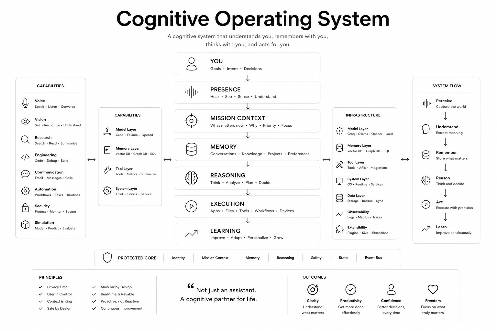

[](https://doi.org/10.5281/zenodo.21369321)

# PCOS
### Personal Cognitive Operating System

> Computers received Operating Systems.
>
> AI received Models.
>
> Humans need Cognitive Operating Systems.

## Research

This repository contains **PCOS (Personal Cognitive Operating System)**, the reference implementation of the **Cognitive Operating Systems (COS)** architecture introduced in the research paper:

### Cognitive Operating Systems: An Architectural Abstraction for Persistent Human-AI Collaboration

**Author:** Bala Brahmaiah Thumbeti  
**Affiliation:** Mohan Babu University, Tirupati, Andhra Pradesh, India  
**Role:** Independent AI Systems Researcher

**Repository:** https://github.com/bbrahmaiah/PCOS

**Status:** Public Research Preprint (Zenodo DOI Published)

## Abstract

Current AI systems generate responses.

They do not govern execution.

They do not maintain persistent cognitive state.

They do not provide structural guarantees around memory, action, interruption, safety, and long-term collaboration.

This work introduces **Cognitive Operating Systems (COS)**, a systems architecture for persistent human-AI collaboration that separates model cognition from governed execution, enabling AI behavior to become:

- Auditable
- Interruptible
- Persistent
- Governed
- Structurally Constrained

Rather than treating safety as a prompt-level problem, COS treats safety as a systems architecture problem.

PCOS is the reference implementation of this architecture.

# COS vs PCOS

## COS

**Cognitive Operating Systems**

The architecture.

The theory.

The systems framework introduced in the paper.

## PCOS

**Personal Cognitive Operating System**

The implementation.

The software system built to validate and evaluate the architecture.

# Vision

The objective is not stronger AI.

The objective is better human-AI collaboration.

A Cognitive Operating System should not merely answer questions.

It should:

- Understand context
- Maintain memory
- Govern execution
- Enforce safety
- Learn continuously
- Collaborate persistently

# Architecture



# Core Cognitive Stack

### Presence

- Voice
- Vision
- Screen Awareness
- Environmental Awareness
- Attention Tracking
- Interruption Handling

### Mission Context

- Goal Awareness
- Project Awareness
- Task Awareness
- Urgency Awareness
- Focus State Tracking

### Memory

- Short-Term Memory
- Long-Term Memory
- Episodic Memory
- Project Memory
- Preference Memory
- Knowledge Graph
- Vector Database

### Reasoning

- Intent Understanding
- Planning
- Decision Making
- Risk Assessment
- Research Synthesis
- Problem Solving

### Execution

- Browser Control
- Application Control
- File System Control
- Terminal Control
- Workflow Automation

### Learning

- Feedback Learning
- Habit Learning
- Preference Learning
- Workflow Learning
- Capability Discovery

# Protected Core

The following components are architecturally protected and never automatically modified:

- Identity Engine
- Mission Context Engine
- Memory Engine
- Reasoning Engine
- Safety Engine
- State Manager
- Event Bus
- Execution Framework

# Technology Stack

## Runtime

- Python

## Operating System

- Windows

## Models

- Ollama
- OpenAI
- Claude
- Gemini
- Groq

## Infrastructure

- SQLite
- ChromaDB
- ZeroMQ
- Pydantic v2

## Voice

- Faster-Whisper
- Piper TTS


# Validation Status

| Metric | Value |
|----------|----------|
| Automated Tests | 3956 Passing |
| Source Files | 642 |
| Architecture | 9-Phase Cognitive Pipeline |
| Voice Pipeline | Operational |
| Memory System | Operational |
| Tool Execution | Operational |


# Research Contribution

This paper contributes **Cognitive Operating Systems (COS)** as a systems architecture for persistent human-AI collaboration.

The architecture separates model cognition from governed execution so that persistent AI behavior becomes:

- Auditable
- Interruptible
- Policy-Constrained
- Structurally Governed

The contribution is not a new model.

The contribution is a new systems architecture.


# Installation

```bash
git clone https://github.com/bbrahmaiah/PCOS.git

cd PCOS

pip install -r requirements.txt

python bootstrap.py
```

# Reproducibility

To reproduce the implementation:

1. Clone the repository
2. Install dependencies
3. Configure local model providers
4. Launch the runtime
5. Execute the validation suite

Additional documentation:

- docs/
- requirements.txt
- tests/

---

# Repository Structure

```text
PCOS/
├── config/
├── docs/
├── jarvis/
├── scripts/
├── tests/
├── bootstrap.py
├── requirements.txt
├── pyproject.toml
└── README.md
```

---

# Disclaimer

PCOS is a research system.

It is intended for experimentation and evaluation of governed AI architectures.

It should not be used in safety-critical, legal, medical, financial, or autonomous decision-making environments without independent verification.

# License

MIT License

Copyright © 2026 Bala Brahmaiah Thumbeti

See LICENSE for details.


# Citation

```bibtex
@misc{thumbeti2026cos,
  title={Cognitive Operating Systems: An Architectural Abstraction for Persistent Human-AI Collaboration},
  author={Thumbeti, Bala Brahmaiah},
  year={2026},
  note={Preprint}
}
```

# Author

**Bala Brahmaiah Thumbeti**

Mohan Babu University  
Independent AI Systems Researcher

Email: bbrahmaiah93.t@gmail.com

GitHub: https://github.com/bbrahmaiah

Repository: https://github.com/bbrahmaiah/PCOS
